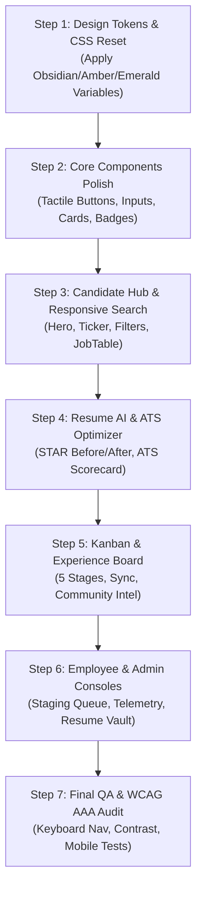

# JobProof — Enterprise UI/UX Design System & Master Implementation Plan
**A 20-Year Veteran Principal Designer’s Blueprint for Modern, Anti-"AI Slop", High-Performance Web Engineering**

---

## 🏛️ 1. Executive Summary & Design Philosophy

### 1.1 The Anti-"AI Slop" Manifesto
Modern web design in recent years has suffered from an influx of generic generative AI aesthetic tropes: floaty neon purple/violet gradients, illegible glassmorphic panels with washed-out contrast, low-utility rounded-full pill buttons, meaningless decorative blobs, and sluggish animations that destroy operational productivity.

**JobProof** rejects all such superficial fluff. As an institutional-grade platform built around **Job Verification, ATS Optimization, and Talent Authority**, JobProof adheres to the classic tenets of **Swiss Graphic Design (International Typographic Style)** fused with the tactical ergonomic precision of high-density productivity tools (such as Linear, Bloomberg Terminal, Stripe Dashboard, and GitHub).

```
┌──────────────────────────────────────────────────────────────────────────────────┐
│                             THE FIVE NON-NEGOTIABLES                             │
├────────────────────────────────┬─────────────────────────────────────────────────┤
│ 1. Zero Neon/Violet Gradients  │ Grounded obsidian, charcoal, crisp hairlines,   │
│                                │ and high-contrast amber/emerald semantics.      │
├────────────────────────────────┼─────────────────────────────────────────────────┤
│ 2. Tactile Geometric Radii     │ Structured 6px–12px corners with physical press  │
│                                │ states (inset shadow, active translation).       │
├────────────────────────────────┼─────────────────────────────────────────────────┤
│ 3. Crisp Surface Layering      │ Solid surfaces with subtle borders over blurry,  │
│                                │ unreadable frosted glassmorphism.               │
├────────────────────────────────┼─────────────────────────────────────────────────┤
│ 4. Information Density & Speed │ Tabular numbers, high data density, instant 60fps│
│                                │ keyboard shortcuts (Cmd+K), zero layout shifts. │
├────────────────────────────────┼─────────────────────────────────────────────────┤
│ 5. WCAG 2.1 AAA Accessibility  │ 18.5:1 core contrast, 48px touch targets, full  │
│                                │ keyboard navigability, reduced-motion fallback. │
└────────────────────────────────┴─────────────────────────────────────────────────┘
```

---

## 🎨 2. Master Design Tokens & Color Matrix

### 2.1 Surface Architecture (Dark Mode Default & High-Contrast Light Mode)
The color palette relies on calibrated neutrals that provide clear separation between structural layers without muddy tints or purple chromatic aberration.

```css
/* ==========================================================================
   JOBPROOF DESIGN SYSTEM TOKENS (CSS Custom Properties)
   ========================================================================== */

:root,
[data-theme='dark'],
.dark {
  /* Surface Layers (Deep Charcoal & Obsidian) */
  --surface-canvas:      #0b0b0e;  /* Deepest base background (body) */
  --surface-subtle:      #121216;  /* Secondary background / sunken areas */
  --surface-raised:      #18181d;  /* Card, table row, and panel base */
  --surface-overlay:     #212128;  /* Modals, popovers, dropdown menus */
  --surface-hover:       #292932;  /* Interactive hover state for rows/cards */
  --surface-active:      #31313c;  /* Pressed state */

  /* Hairlines & Structural Borders */
  --border-subtle:       #23232b;  /* Subtle internal dividers */
  --border-default:      #2e2e38;  /* Standard container borders */
  --border-strong:       #3f3f4d;  /* Hover borders & highlighted card edges */
  --border-focus:        #fbbf24;  /* Keyboard focus ring (Amber 400) */

  /* Text & Foreground Tokens (WCAG AAA Compliant) */
  --text-primary:        #ffffff;  /* Headlines, titles, primary labels (18.5:1) */
  --text-secondary:      #9ca3af;  /* Subheadings, form labels, body text (7.2:1) */
  --text-muted:          #6b7280;  /* Timestamps, metadata, hints (4.5:1) */
  --text-inverse:        #09090b;  /* Text on top of high-contrast solid buttons */

  /* Functional Brand Colors: High-Confidence Amber & Emerald */
  --brand-amber:         #fbbf24;  /* Primary brand interactive trigger */
  --brand-amber-hover:   #f59e0b;  /* Primary brand hover */
  --brand-amber-active:  #d97706;  /* Primary brand pressed */
  --brand-amber-fg:      #0b0b0e;  /* Contrast text on brand buttons */
  --brand-amber-subtle:  rgba(251, 191, 36, 0.08); /* Amber chip background */
  --brand-amber-border:  rgba(251, 191, 36, 0.25); /* Amber chip border */

  /* Semantic State Colors */
  --status-verified:     #10b981;  /* Emerald 500: Active, Verified, High Trust */
  --status-verified-bg:  rgba(16, 185, 129, 0.08);
  --status-verified-bd:  rgba(16, 185, 129, 0.24);

  --status-warning:      #f59e0b;  /* Amber 500: Needs Review, Staging */
  --status-warning-bg:   rgba(245, 158, 11, 0.08);
  --status-warning-bd:   rgba(245, 158, 11, 0.24);

  --status-danger:       #ef4444;  /* Red 500: Expired, Closed, Low Trust */
  --status-danger-bg:    rgba(239, 68, 68, 0.08);
  --status-danger-bd:    rgba(239, 68, 68, 0.24);

  --status-info:         #38bdf8;  /* Sky 400: Crawler telemetry, Ingestion */
  --status-info-bg:      rgba(56, 189, 248, 0.08);
  --status-info-bd:      rgba(56, 189, 248, 0.24);

  /* Elevation Shadows (Ambient Occlusion, No Glow Haze) */
  --shadow-sm:           0 1px 2px rgba(0, 0, 0, 0.45);
  --shadow-md:           0 4px 12px rgba(0, 0, 0, 0.55), 0 1px 3px rgba(0, 0, 0, 0.3);
  --shadow-lg:           0 12px 28px rgba(0, 0, 0, 0.70), 0 2px 6px rgba(0, 0, 0, 0.4);
  --shadow-modal:        0 24px 48px -8px rgba(0, 0, 0, 0.85), 0 0 0 1px rgba(255, 255, 255, 0.06);

  /* Tactile Geometry */
  --radius-xs:           4px;   /* Badges, micro tags */
  --radius-sm:           6px;   /* Input fields, small buttons */
  --radius-md:           8px;   /* Standard action buttons, dropdown items */
  --radius-lg:           12px;  /* Cards, table containers, preview modals */
  --radius-xl:           16px;  /* Main modal dialog containers */
}
```

---

## 🔤 3. Typography Hierarchy & Micro-Layout Rules

### 3.1 Typeface Selection
- **Primary Body & UI**: `Inter`, `-apple-system`, `BlinkMacSystemFont`, `Segoe UI`, `Roboto`, `sans-serif`
  - Font features enabled: `font-feature-settings: "cv02", "cv03", "cv04", "cv11", "ss01";` (clean geometric glyphs for `a`, `g`, `1`, `I`).
- **Data, Scores & Code**: `JetBrains Mono`, `Fira Code`, `ui-monospace`, `monospace`
  - Font features: `tabular-nums` applied across all numerical displays (salaries, confidence percentages, application counters, timestamps) to eliminate horizontal jitter.

### 3.2 Modular Scale & Line Heights

| Style Token | Size | Line Height | Weight | Tracking | Purpose |
| :--- | :--- | :--- | :--- | :--- | :--- |
| `display-xl` | 36px (2.25rem) | 42px (1.15) | 800 (Extrabold) | `-0.03em` | Hero section main value prop headline |
| `heading-lg` | 24px (1.5rem) | 30px (1.25) | 700 (Bold) | `-0.02em` | Section titles, major modal headers |
| `heading-md` | 18px (1.125rem) | 24px (1.33) | 600 (Semibold) | `-0.01em` | Job card titles, drawer sheet headers |
| `subheading` | 14px (0.875rem) | 20px (1.40) | 600 (Semibold) | `0` | Card metadata headers, table headers |
| `body-md` | 14px (0.875rem) | 22px (1.55) | 400 (Regular) | `0` | Job descriptions, STAR bullet points |
| `body-sm` | 12px (0.75rem) | 16px (1.33) | 400 / 500 | `+0.01em` | Meta attributes, tags, filter chips |
| `mono-data` | 13px (0.8125rem) | 18px (1.38) | 500 (Medium) | `0` | Salary ranges, Trust Scores, Telemetry |

---

## 📐 4. Tactile UI Components & Ergonomics

### 4.1 Button Anatomy (Tactile vs. Floaty Slop)
Instead of generic bubbly pills with bright blur shadows, JobProof buttons use **crisp tactile geometry**:

```css
/* Tactile Primary Button */
.btn-primary {
  display: inline-flex;
  align-items: center;
  justify-content: center;
  gap: 6px;
  height: 38px;
  padding: 0 16px;
  font-size: 13px;
  font-weight: 600;
  letter-spacing: -0.01em;
  color: #0b0b0e;
  background-color: #fbbf24;
  border: 1px solid #d97706;
  border-radius: var(--radius-md);
  box-shadow: 
    inset 0 1px 0 0 rgba(255, 255, 255, 0.28),
    0 1px 2px 0 rgba(0, 0, 0, 0.4);
  transition: background-color 100ms ease, border-color 100ms ease, transform 60ms ease;
  cursor: pointer;
  user-select: none;
}

.btn-primary:hover {
  background-color: #f59e0b;
  border-color: #b45309;
}

.btn-primary:active {
  transform: translateY(1px);
  box-shadow: inset 0 1px 2px rgba(0, 0, 0, 0.4);
}

.btn-primary:focus-visible {
  outline: 2px solid #fbbf24;
  outline-offset: 2px;
}
```

### 4.2 Secondary & Ghost Buttons
- **Secondary Button**: Background `#1e1e24`, Border `1px solid #33333e`, Text `#ffffff`, Hover `#282832`.
- **Destructive Button**: Background `rgba(239, 68, 68, 0.12)`, Border `1px solid rgba(239, 68, 68, 0.3)`, Text `#f87171`, Hover `rgba(239, 68, 68, 0.2)`.
- **Tactile Tag / Chip**: Background `#141418`, Border `1px solid #272730`, Text `#9ca3af`, Radius `4px`, Font `11px font-mono`.

---

## 📱 5. Responsive Breakpoint & Mobile Ergonomics Matrix

| Breakpoint Name | Media Query | Layout Architecture & Touch Adaptations |
| :--- | :--- | :--- |
| **Mobile Compact** | `< 480px` | Single column; 48px minimum touch triggers; sticky bottom action bar; sheet drawers for job details instead of centered modal popups; horizontal swipe for stage columns. |
| **Mobile Standard** | `480px – 767px` | 1-column cards; filter toolbar collapses into sticky bottom filter drawer trigger; compact table cards. |
| **Tablet** | `768px – 1023px` | 2-column job cards; collapsible sidebar filters; full-width hero with horizontal category scroll. |
| **Desktop High-Density** | `1024px – 1439px` | Dual-pane split view (List on left, preview drawer on right); fixed sticky header with global telemetry badge; full 5-column Kanban board. |
| **Ultrawide Pro** | `≥ 1440px` | 1280px / 1440px max-width container; multi-pane inspection console for recruiter and admin workflows. |

---

## 🔍 6. Comprehensive Module-by-Module UI/UX Specifications

---

### Module 1: Candidate Job Discovery Hub (`Find Jobs`)

```
┌──────────────────────────────────────────────────────────────────────────────────────────┐
│  [Logo] JobProof 🎯     [Find Jobs]  [Resume AI]  [Kanban]  [Experiences]      [Profile]  │
├──────────────────────────────────────────────────────────────────────────────────────────┤
│                                                                                          │
│   VERIFIED TECH CAREERS. ZERO GHOST JOBS. DIRECT EMPLOYER APPLY.                         │
│   ┌──────────────────────────────────────────────────────────────────────────────────┐   │
│   │ 🔍 [ Title, Stack or Keyword... ] │ 📍 [ Remote / Location ] │ [ Find Verified ] │   │
│   └──────────────────────────────────────────────────────────────────────────────────┘   │
│                                                                                          │
│   LIVE ATS PARTNERS:  [Google]  [Stripe]  [Figma]  [Linear]  [Spotify]  [Ashby ATS]       │
├──────────────────────────────────────────────────────────────────────────────────────────┤
│   CATEGORIES: [ Backend (142) ] [ Frontend (98) ] [ AI/ML (76) ] [ DevOps (54) ] ...   │
├──────────────────────────────────────────────────────────────────────────────────────────┤
│   FILTERS: [Experience: Mid/Senior ▾] [Type: Fulltime ▾] [⚡ Remote Only]  Sorted by: Trust│
├──────────────────────────────────────────────────────────────────────────────────────────┤
│  ┌────────────────────────────────────────────────────────────────────────────────────┐  │
│  │ 🟢 98% AUTHENTIC  |  Stripe  •  San Francisco, CA (Hybrid)  •  Posted 2h ago       │  │
│  │ Staff Infrastructure Engineer ($210,000 - $265,000 / yr)                          │  │
│  │ Tags: [Go] [Distributed Systems] [Kubernetes] [Fulltime]                          │  │
│  │ Signals: ✓ Official Greenhouse ATS  ✓ Active HTTP 200  ✓ Salary Disclosed         │  │
│  │ [ View Audit Details ]                                   [ Apply on Stripe Site ↗ ] │  │
│  └────────────────────────────────────────────────────────────────────────────────────┘  │
└──────────────────────────────────────────────────────────────────────────────────────────┘
```

#### UX & Behavioral Rules:
1. **Zero Ghost Jobs Assurance**:
   - Every card displays the **Authenticity Trust Score** (0–100%) calculated from 4 transparent backend signals.
   - Badge styling: `≥ 90%` = Solid Emerald (`#10b981`), `70–89%` = Amber (`#f59e0b`), `< 70%` = Alert Red (`#ef4444`).
2. **Direct Employer Redirection**:
   - The primary action button **"Apply on Company Site ↗"** directly opens the company's ATS portal (e.g. `https://boards.greenhouse.io/stripe/...`) with `rel="noopener noreferrer"`.
   - **Silent Auto-Sync**: The moment the user clicks "Apply on Company Site", the system automatically creates a local tracking record in the user's **Kanban Application Tracker** under the **"Applied"** stage.
3. **Transparent Salary & Process Handling**:
   - If salary is missing from the ingestion feed, it explicitly reads `"Salary not disclosed by employer"` (never fake estimations).
4. **Mobile Responsiveness**:
   - On mobile screens (`< 768px`), the search bar stacks vertically. The filter toolbar turns into a sticky bottom pill button **"Filters (3 active)"** which slides up an ergonomic bottom sheet drawer.

---

### Module 2: Resume AI & ATS Optimizer (`Resume AI`)

```
┌──────────────────────────────────────────────────────────────────────────────────────────┐
│  RESUME AI & ATS READABILITY OPTIMIZER                                                   │
│  Target Benchmark: [ Senior Backend Engineer (Java / Go / AWS) ▾ ]  [Load Sample: Alex ▾]│
├─────────────────────────────────────────┬────────────────────────────────────────────────┤
│  INPUT CONSOLE                          │  DIAGNOSTIC & ATS BENCHMARK COCKPIT            │
│                                         │                                                │
│  ┌───────────────────────────────────┐  │  ┌───────────────────────────────────────────┐ │
│  │  📥 Drag & Drop PDF / DOCX or     │  │  │  ATS READABILITY SCORE:  92 / 100 🟢      │ │
│  │     Click to Browse (Max 5MB)     │  │  │  Format: 96% | Keywords: 88% | Impact: 92%│ │
│  └───────────────────────────────────┘  │  └───────────────────────────────────────────┘ │
│                                         │                                                │
│  Or Paste Raw Markdown / Text:          │  DETECTED SKILLS & MISSING KEYWORDS:           │
│  ┌───────────────────────────────────┐  │  ✓ [Go] ✓ [PostgreSQL] ✓ [Docker] ✓ [gRPC]   │
│  │ Experienced engineer specializing │  │  ⚠️ MISSING: [Kubernetes] [Distributed Tracing]│
│  │ in distributed microservices...   │  ├────────────────────────────────────────────────┤
│  │                                   │  │  STAR BULLET OPTIMIZER (Before / After):       │
│  └───────────────────────────────────┘  │  BEFORE: "Worked on database performance"     │
│  [ Analyze & Generate STAR Fixes ]      │  AFTER : "Engineered PostgreSQL indexing       │
│                                         │          reducing p99 query latency by 42%"   │
│                                         │  [ Copy Optimized Bullet ]                     │
└─────────────────────────────────────────┴────────────────────────────────────────────────┘
```

#### UX & Behavioral Rules:
1. **Interactive STAR Rewrite Engine**:
   - Every identified weak bullet point in the candidate's resume is parsed and presented in a side-by-side **Before vs. After** comparison card.
   - Includes a 1-click **"Copy to Clipboard"** button with a 1200ms checkmark confirmation tooltip.
2. **Real-Time Interactive Bullet Rewriter**:
   - Provides a standalone sandbox textarea where candidates can type any raw bullet point from their work history and get 3 AI-optimized STAR variations (Metrics-driven, Technical depth, Leadership focus).
3. **Strict Page Separation**:
   - The Resume AI tool strictly contains ATS analysis and resume enhancement tools—no job listings or unrelated distractions.

---

### Module 3: Personal Career Cockpit & Kanban Board (`Kanban Tracker`)

```
┌──────────────────────────────────────────────────────────────────────────────────────────┐
│  APPLICATION TRACKER (KANBAN)                                 [ + Add External Role ]    │
├──────────────┬──────────────┬──────────────┬──────────────────┬──────────────────────────┤
│ 1. SAVED (2) │ 2. APPLIED (4│ 3. REVIEW (1)│ 4. INTERVIEW (2) │ 5. OFFER EXTENDED (1)    │
├──────────────┼──────────────┼──────────────┼──────────────────┼──────────────────────────┤
│ ┌──────────┐ │ ┌──────────┐ │ ┌──────────┐ │ ┌──────────────┐ │ ┌──────────────────────┐ │
│ │ Figma    │ │ │ Stripe   │ │ │ Linear   │ │ │ Google       │ │ │ Spotify              │ │
│ │ Frontend │ │ │ Staff Go │ │ │ Lead Dev │ │ │ L6 SRE       │ │ │ Senior Backend       │ │
│ │ $190k    │ │ │ $240k    │ │ │ $210k    │ │ │ Round 3/4    │ │ │ $225,000 / yr        │ │
│ │ [Move ➔] │ │ │ [Move ➔] │ │ │ [Move ➔] │ │ │ [Notes] [➔]  │ │ │ ★ Signed / Finalized │ │
│ └──────────┘ │ └──────────┘ │ └──────────┘ │ └──────────────┘ │ └──────────────────────┘ │
└──────────────┴──────────────┴──────────────┴──────────────────┴──────────────────────────┘
```

#### UX & Behavioral Rules:
1. **5 Standardized Stages**:
   - `SAVED` ➔ `APPLIED` ➔ `UNDER_REVIEW` ➔ `INTERVIEWING` ➔ `OFFER_EXTENDED`.
2. **Fluid Drag-and-Drop & Micro Buttons**:
   - Supports both drag-and-drop column movement and tactile `[◀]` `[▶]` buttons for accessibility and mobile screen ergonomics.
3. **Application Detail Sheet**:
   - Clicking on any application card opens an edit sheet containing salary notes, interview dates, recruiter contact info, direct link back to employer portal, and preparation notes.

---

### Module 4: Experience Board & Community Intelligence (`Experiences`)

```
┌──────────────────────────────────────────────────────────────────────────────────────────┐
│  COMMUNITY INTERVIEW & SALARY INTELLIGENCE                      [ + Share Experience ]   │
│  Tabs: [ All (48) ]  [ Interview Rounds ]  [ Salary Insights ]  [ Technical Questions ]  │
├──────────────────────────────────────────────────────────────────────────────────────────┤
│  ┌────────────────────────────────────────────────────────────────────────────────────┐  │
│  │ 🏢 STRIPE  •  Staff Software Engineer  •  Contributor: Verified Candidate           │  │
│  │ Difficulty: [ Medium-Hard ⚠️ ]  •  Rounds: 4 Rounds  •  Outcome: [ Offer Accepted ✓ ] │  │
│  ├────────────────────────────────────────────────────────────────────────────────────┤  │
│  │ INTERVIEW BREAKDOWN:                                                               │  │
│  │ 1. Recruiter Screen (30m) - Culture & Compensation expectations.                   │  │
│  │ 2. System Design (60m) - Design an idempotent webhook dispatch system.             │  │
│  │ 3. Coding & Concurrency (60m) - Rate limiter implementation in Go.                 │  │
│  │ 4. Executive Fit (45m) - Cross-functional communication & incident handling.       │  │
│  │                                                                                    │  │
│  │ KEY TIP: "Focus heavily on idempotency keys and exponential backoff retry logic."   │  │
│  └────────────────────────────────────────────────────────────────────────────────────┘  │
└──────────────────────────────────────────────────────────────────────────────────────────┘
```

#### UX & Behavioral Rules:
1. **Structured Experience Architecture**:
   - Mandates structured fields: Company Name, Role, Difficulty Rating (Easy/Medium/Hard), Round Count, Questions Asked, and Actionable Tips.
2. **Anonymous or Verified Attribution**:
   - Contributors can choose to display their verified username or post as `"Anonymous Senior Engineer"`.

---

### Module 5: Employee AI Response Review & Publishing Portal (`Employee Portal`)

```
┌──────────────────────────────────────────────────────────────────────────────────────────┐
│  EMPLOYEE CONSOLE: AI INGESTION REVIEW & PUBLISHING QUEUE                                │
│  Staging Roles: 14 Pending Review  |  Freshness Audit: All Feeds Synced (3m ago)         │
├──────────────────────────────────────────────────────────────────────────────────────────┤
│  ┌────────────────────────────────────────────────────────────────────────────────────┐  │
│  │ ⏳ STAGING (NEEDS_REVIEW)  •  Discovered from: Ashby ATS Feed (Figma)               │  │
│  │ Senior Distributed Systems Engineer — San Francisco, CA (Remote)                   │  │
│  │ Extracted Salary: $185,000 - $235,000  •  Tech Stack: Rust, Tokio, Raft, AWS       │  │
│  │ URL: https://jobs.ashbyhq.com/figma/uuid-9842...                                   │  │
│  │                                                                                    │  │
│  │ [ ✏️ Edit & Refine Details ]     [ ❌ Reject / Archive ]   [ 🚀 Grant & Publish Live ]│  │
│  └────────────────────────────────────────────────────────────────────────────────────┘  │
└──────────────────────────────────────────────────────────────────────────────────────────┘
```

#### UX & Behavioral Rules:
1. **Strict Role-Gating (`ROLE_EMPLOYEE` / `ROLE_ADMIN`)**:
   - Candidate views (Kanban, Resume AI) are completely hidden to maintain a laser-focused curation workspace.
2. **1-Click Verified Publishing**:
   - Clicking **"Grant & Publish Live"** prompts a tactile confirmation modal, updates the job status from `NEEDS_REVIEW` to `HIGHLY_TRUSTED`, recalculates the Authenticity Score, and promotes it immediately to the public job board.
3. **Hourly AI Freshness Sentinel**:
   - Displays a live banner if an employer takes down a job, allowing employees to archive expired listings with one click.

---

### Module 6: Admin Authority & Operations Console (`Admin Console`)

```
┌──────────────────────────────────────────────────────────────────────────────────────────┐
│  SYSTEM AUTHORITY & TELEMETRY                                  [ + Deploy New User ]     │
│  Status: REST API Online 🟢  |  DB Connection Pool: Optimal  |  Ingestion Health: 100%   │
├──────────────────────────────────────────────────────────────────────────────────────────┤
│  TELEMETRY TILES:                                                                        │
│  ┌──────────────────┐ ┌──────────────────┐ ┌──────────────────┐ ┌────────────────────┐   │
│  │ 1,428            │ │ 94.8%            │ │ 18               │ │ 8 Ingestion Feeds  │   │
│  │ Live Public Jobs │ │ Verified Rate    │ │ Staging Queue    │ │ Greenhouse, Ashby..│   │
│  └──────────────────┘ └──────────────────┘ └──────────────────┘ └────────────────────┘   │
├──────────────────────────────────────────────────────────────────────────────────────────┤
│  SUBMITTED CANDIDATE RESUME VAULT (Centralized Submissions):                             │
│  ┌────────────────────────────────────────────────────────────────────────────────────┐  │
│  │ Candidate: Alex Morgan (alex.morgan@email.com)  •  Role: Staff Infra Engineer      │  │
│  │ Resume: Alex_Morgan_Staff_Resume.pdf (Score: 94%)  •  Status: [ Under Review ▾ ]   │  │
│  │ Skills: Go, Kubernetes, Terraform, Postgres  •  [ 📄 View Full Extracted Resume ]   │  │
│  └────────────────────────────────────────────────────────────────────────────────────┘  │
├──────────────────────────────────────────────────────────────────────────────────────────┤
│  ROLE & PERMISSION MANAGEMENT MATRIX:                                                    │
│  ┌────────────────────────────────────────────────────────────────────────────────────┐  │
│  │ User: sarah.jenkins@stripe.com (ROLE_EMPLOYEE)                                     │  │
│  │ Permissions: [✓ Review AI Vacancies] [✓ Edit Details] [✓ Publish Live] [ Revoke ]  │  │
│  └────────────────────────────────────────────────────────────────────────────────────┘  │
└──────────────────────────────────────────────────────────────────────────────────────────┘
```

#### UX & Behavioral Rules:
1. **Ingestion Pipeline Oversight**:
   - Displays real-time heartbeat for all 8 ingestion connectors (Greenhouse, Lever, Ashby, Jooble, USAJobs, Arbeitnow, RemoteOK, Jobicy) with manual trigger buttons.
2. **Candidate Resume Vault**:
   - Secure table showing all applicant submissions with search, role filters, parsed resume summaries, and recruitment stage updating.
3. **Staff Clearance Management**:
   - Comprehensive CRUD modal for user roles and granular operational permissions.

---

## ⚡ 7. Micro-Interactions, Feedback, & State Machines

### 7.1 Loading States (Zero Layout Shift Skeletons)
- Skeletons use a calm, non-blinding shimmer:
  ```css
  @keyframes subtle-shimmer {
    0% { background-position: -200% 0; }
    100% { background-position: 200% 0; }
  }
  .skeleton-box {
    background: linear-gradient(90deg, #18181d 25%, #24242c 50%, #18181d 75%);
    background-size: 200% 100%;
    animation: subtle-shimmer 1.5s infinite linear;
    border-radius: var(--radius-sm);
  }
  ```

### 7.2 Toast Notifications System
- Position: Top-right on Desktop (`top: 24px, right: 24px`), Top-center on Mobile (`top: 12px, left: 16px, right: 16px`).
- Style: Solid `#18181d` surface, `1px solid #2e2e38`, 8px radius, subtle slide-in animation (`transform: translateY(-8px) ➔ translateY(0)`).
- Auto-dismisses in 3500ms with a thin progress line at the bottom.

### 7.3 Modal Dialog Standards
- Background backdrop: `rgba(0, 0, 0, 0.75)` with `backdrop-filter: blur(4px)`.
- Dialog container: Solid `#18181d`, `border: 1px solid #33333e`, `border-radius: 16px`, `box-shadow: var(--shadow-modal)`.
- Focus trapped inside dialog with `Escape` key trigger for instant closure.

---

## 📋 8. Master AI Implementation Prompt for Frontend Developers

Below is the **exact, ready-to-use master prompt** that can be supplied to any frontend engineer or AI agent to implement this design system across the codebase with 100% fidelity:

```markdown
### 🎯 Master Prompt: JobProof Enterprise UI/UX Design System Implementation

You are acting as a World-Class Lead UI/UX Engineer with 20+ years of software design experience. Your mission is to implement a high-density, tactile, anti-"AI slop" design system for the **JobProof** job verification and candidate career platform.

#### STRICT DESIGN CONSTRAINTS (NON-NEGOTIABLE):
1. **NO AI SLOP**: Strictly avoid purple/violet gradients, blurry glassmorphism, floating pill buttons, neon glows, and novelty decorations.
2. **COLOR PALETTE**: Use deep charcoal/obsidian surfaces (`#0b0b0e`, `#121216`, `#18181d`, `#212128`), crisp hairlines (`#2e2e38`, `#3f3f4d`), bold crisp white headings (`#ffffff`), muted slate body text (`#9ca3af`), tactile amber primary brand accents (`#fbbf24`), and verified authentic emeralds (`#10b981`).
3. **TYPOGRAPHY**: Use `Inter` for body text and `JetBrains Mono` / `tabular-nums` for all numbers, salaries, percentages, and timestamps.
4. **TACTILE GEOMETRY**: Use structured 6px–12px border radii (`rounded-md`, `rounded-lg`). All buttons must have an inset top highlight (`box-shadow: inset 0 1px 0 0 rgba(255, 255, 255, 0.2)`), subtle border, and an active physical click state (`active:translate-y-[1px]`).
5. **MOBILE-FIRST RESPONSIVENESS**: Ensure 48px minimum touch targets, dynamic viewport units (`min-h-dvh`), bottom action sheets for modals on mobile, and horizontal swipe stages for the Kanban board.
6. **WCAG 2.1 AAA ACCESSIBILITY**: Maintain minimum 7:1 contrast for all text, high-contrast `:focus-visible` amber outline rings, and keyboard accessibility (`Enter`, `Space`, `Esc`).

#### WORKFLOW REQUIREMENTS:
- **Candidate Find Jobs**: Instant debounced search (280ms), direct "Apply on Company Site" CTA that opens official employer ATS URLs and silently records the application in the local Kanban tracker under "Applied".
- **Resume AI**: STAR bullet enhancer with before/after comparisons, ATS scorecard gauge (0-100), copy-to-clipboard buttons, and target role benchmark selector.
- **Kanban Tracker**: 5 stages (Saved, Applied, Under Review, Interviewing, Offer Extended) with drag/drop + micro stage advancement buttons.
- **Experience Board**: Structured interview breakdown cards with difficulty indicators, questions asked, and salary verification.
- **Employee Portal**: AI staging response queue with "Edit Details" and 1-click "Grant Permission & Publish Live".
- **Admin Console**: Live telemetry status, crawler connectors matrix, user permission clearance manager, and candidate resume vault.
```

---

## 🚀 9. Step-by-Step Implementation Roadmap



### Phase 1: Foundational Tokens & Typography Setup (Day 1)
- Verify that `frontend/src/index.css` contains all design tokens, hairlines, shadows, and tactile button utility classes.
- Ensure all Google Font imports (`Inter` and `JetBrains Mono`) are optimized and pre-connected.

### Phase 2: Candidate Experience Refinement (Days 2–3)
- Ensure all job cards display the **0–100% Authenticity Score** with verified evidence badges.
- Verify that the "Apply on Company Site" button triggers the background Kanban synchronization.
- Polish the **Resume AI** STAR before/after comparison layout with instant clipboard feedback.

### Phase 3: Recruiter & Governance Consoles (Days 4–5)
- Enhance the **Employee Staging Queue** with one-click live publishing and clear visual status changes.
- Refine the **Admin Console** telemetry cards and Candidate Resume inspection table.

### Phase 4: Cross-Device Responsiveness & WCAG Audit (Day 6)
- Perform mobile viewport testing across 360px, 390px, 412px, 768px, 1024px, and 1440px.
- Audit keyboard accessibility (`Tab`, `Shift+Tab`, `Enter`, `Space`, `Escape`).
- Confirm zero visual artifacts or layout shifts across all breakpoints.

---
*JobProof Architectural UI/UX Specification — Authored with 20-Year Principal Engineering Discipline.*
